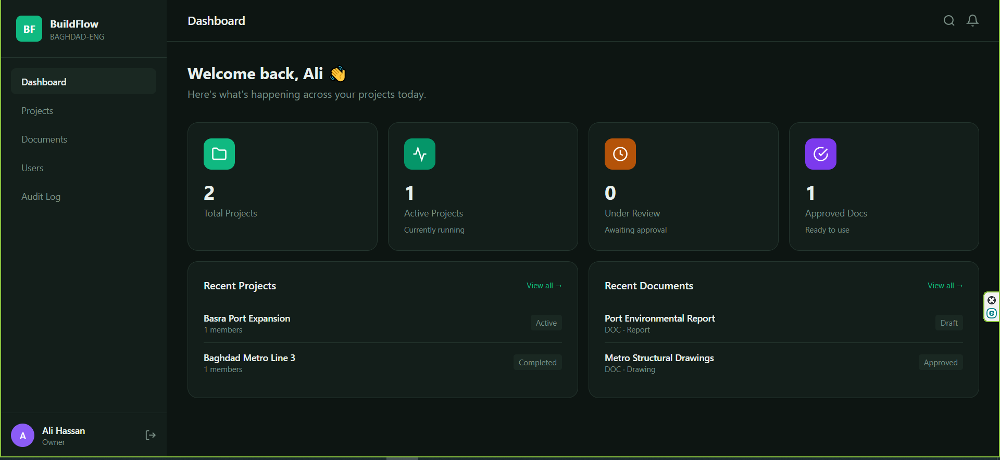
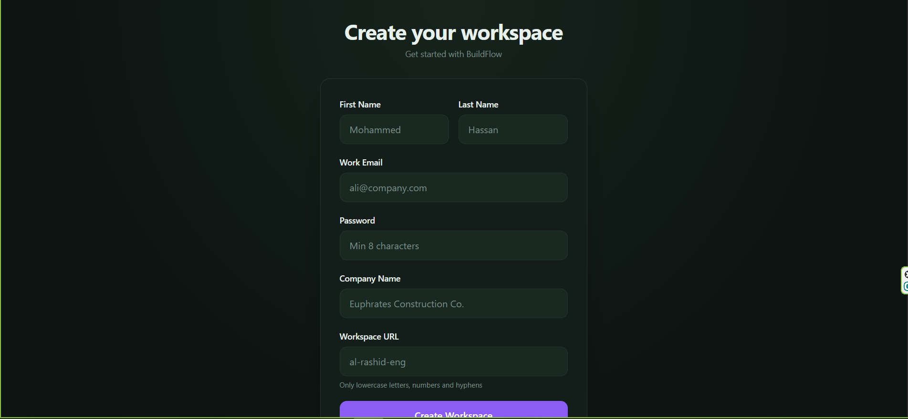
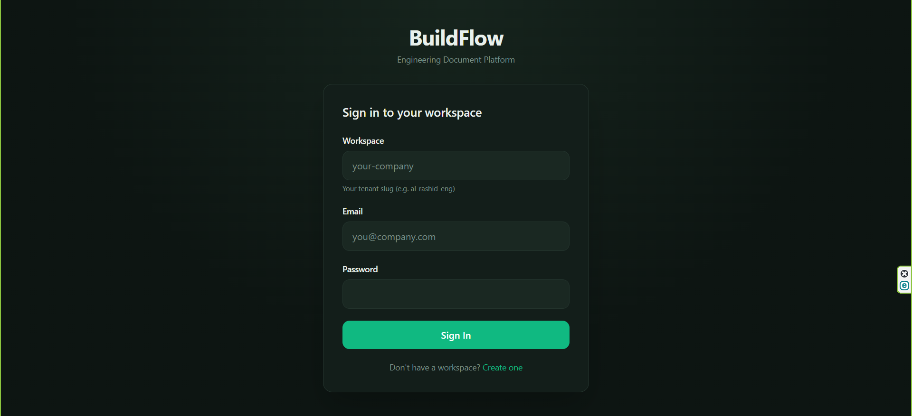
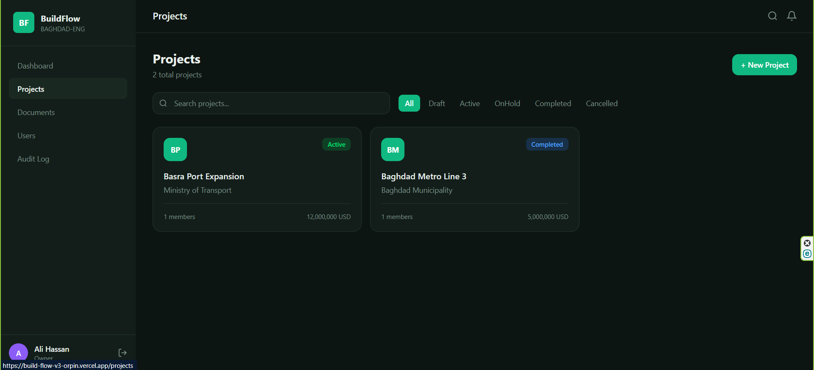
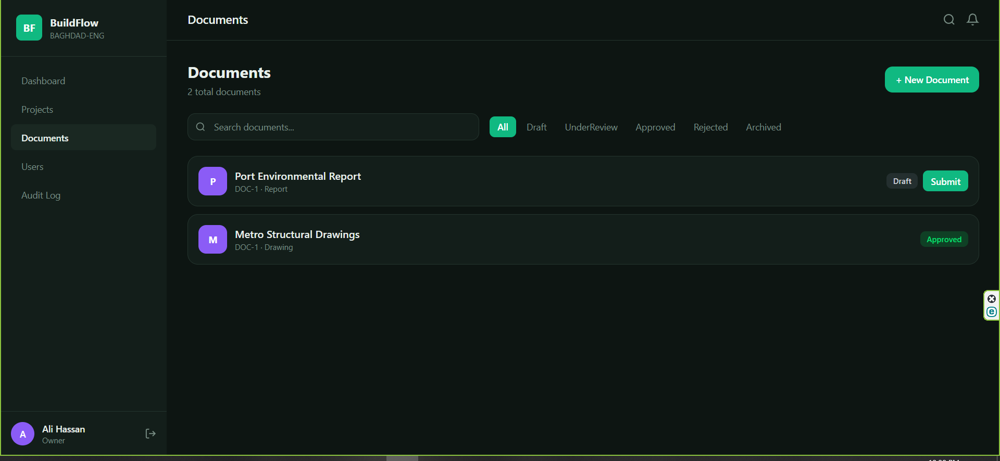
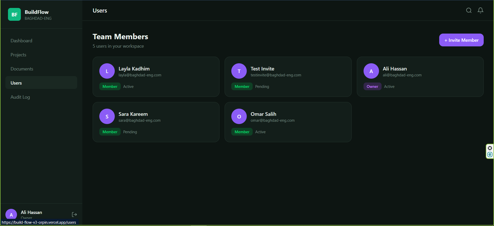
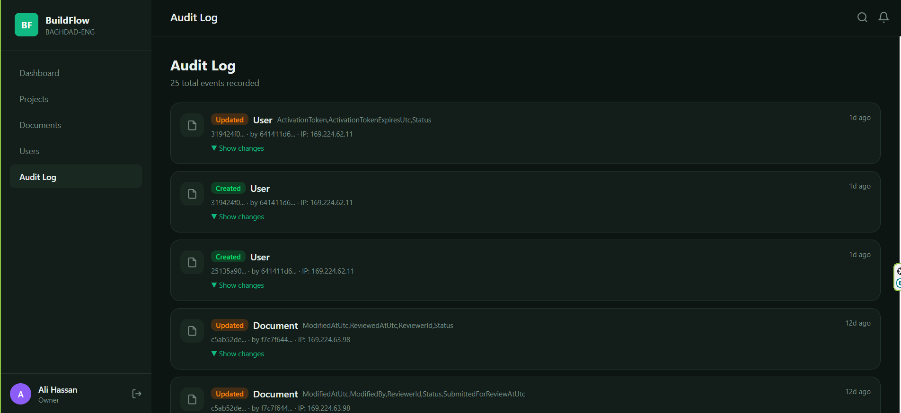
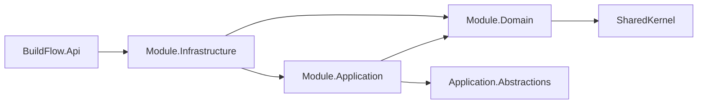

<div align="center">

# BuildFlow

**Engineering Document Workflow SaaS** — a multi-tenant platform for engineering offices and contracting firms to manage documents through a structured review and approval lifecycle.

Built with .NET 8 as a modular monolith: Domain-Driven Design, Clean Architecture, CQRS, full observability, and a live deployment.

[](https://github.com/luaay/BuildFlow-V3/actions/workflows/ci.yml)
[](https://dotnet.microsoft.com/)
[](https://react.dev/)
[](https://www.microsoft.com/sql-server)
[](https://redis.io/)
[](https://www.docker.com/)
[](https://opentelemetry.io/)
[](./LICENSE)

### [🚀 Live API](https://buildflow.runasp.net/swagger) · [🖥️ Live Web App](https://build-flow-v3-orpin.vercel.app)

### 📺 Watch it being built — [Arabic Series](https://www.youtube.com/watch?v=BtDY8nP7s-s&list=PLvQd5bL8gZSsOxYZfdleDcERevGIcvYbm) · [English Series](https://www.youtube.com/watch?v=FO4FBGiJ4L8&list=PLvQd5bL8gZSvASa69AODKURjOwHcvTjKz)

<br />



</div>

---

Engineering firms handle drawings and specifications that move through a review cycle: an author submits a document, a reviewer approves or rejects it, and every change has to be traceable. BuildFlow models that domain as a **modular monolith** with strict boundaries — each module could be extracted into its own service without rewriting a line of business logic.

> **No signup barrier.** Swagger is enabled on the live API on purpose. Register a workspace and you get a fully isolated tenant to explore. In a real production system it would be restricted.

---

## Table of contents

- [Screenshots](#screenshots)
- [What this project demonstrates](#what-this-project-demonstrates)
- [Architecture](#architecture)
- [Tech stack](#tech-stack)
- [Features](#features)
- [Observability](#observability)
- [Caching](#caching)
- [API layer](#api-layer)
- [Key design decisions](#key-design-decisions)
- [Running locally](#running-locally)
- [Testing](#testing)
- [Trade-offs](#trade-offs)
- [Roadmap](#roadmap)
- [Video series](#video-series)
- [License](#license)

---

## Screenshots

<table>
<tr>
<td width="50%"><br /><sub><b>Workspace registration</b> — self-service tenant creation with its owner user.</sub></td>
<td width="50%"><br /><sub><b>Login</b> — JWT issued with tenant and role claims embedded.</sub></td>
</tr>
<tr>
<td width="50%"><br /><sub><b>Projects</b> — lifecycle status, budget, members, filtering and pagination.</sub></td>
<td width="50%"><br /><sub><b>Documents</b> — review workflow with an assigned reviewer and versions.</sub></td>
</tr>
<tr>
<td width="50%"><br /><sub><b>Users</b> — role management and the invitation flow. This list is Redis-cached.</sub></td>
<td width="50%"><br /><sub><b>Audit trail</b> — every change captured automatically, with old and new values.</sub></td>
</tr>
</table>

---

## What this project demonstrates

| Area | What's here |
|---|---|
| **Architecture** | Modular monolith, Domain-Driven Design, Clean Architecture, CQRS, vertical slices |
| **Domain modelling** | Aggregates, value objects, domain events, invariants enforced inside entities |
| **Cross-cutting concerns** | MediatR pipeline behaviours: tracing, logging, validation, performance |
| **Multi-tenancy** | Tenant isolation enforced at claim, query, cache-key, index, and audit level |
| **Observability** | OpenTelemetry traces, metrics, and trace-correlated structured logs |
| **Performance** | Distributed caching with explicit, tenant-scoped invalidation |
| **Auditing** | Automatic change log via an EF Core `SaveChanges` interceptor |
| **Data** | EF Core migrations across four bounded-context DbContexts |
| **Testing** | 90 domain unit tests plus integration tests against real SQL Server via Testcontainers |
| **Delivery** | Docker Compose, GitHub Actions CI, deployed and running in production |

---

## Architecture

```
src/
├── SharedKernel/                    Entity, AggregateRoot, ValueObject, DomainEvent, AppError, auditing
├── BuildingBlocks/
│   ├── Application.Abstractions/    CQRS contracts, pipeline behaviours, cache + activity source
│   └── SharedInfrastructure/        Audit interceptor & store, Redis cache implementation
├── Modules/
│   ├── Identity/                    Tenants, users, roles, JWT auth, invitations
│   ├── Projects/                    Projects, members, budgets, status lifecycle
│   └── Documents/                   Documents, versions, review workflow
└── BuildFlow.Api/                   Composition root, Minimal API endpoints, observability wiring

client/                              React + TypeScript SPA
tests/                               Domain unit tests + integration tests
docs/                                Screenshots
```

Each module is split into four layers with a strict dependency direction:



**Domain has no outward dependencies at all** — no EF Core, no ASP.NET, no MediatR. Business rules live inside aggregates and are enforced by the entities themselves, not by handlers.

**Modules never reference each other.** They communicate through the composition root and shared abstractions only, which is what makes the boundaries real rather than decorative. Boundaries are enforced at the project-reference level, so a violation fails the build rather than a code review.

### Request flow

An HTTP request becomes a command or query, passes through the MediatR pipeline, and reaches exactly one handler:

```
Endpoint → Command/Query → [ Tracing → Logging → Validation → Performance ] → Handler → Repository → DB
```

Behaviour order is deliberate. Tracing is registered first so its span wraps everything after it — which means a failed validation appears *inside* the trace rather than outside it, and a slow validator is visible as its own segment.

### Results, not exceptions

Business failures — wrong password, duplicate email, invalid status transition — are returned as `Result` values via **FluentResults**, never thrown. Exceptions are reserved for genuinely unexpected failures.

This distinction runs all the way through the system: it is why a rejected login shows up as a normal span in the observability dashboard instead of a red error, keeping "red" meaningful for things that actually need attention.

---

## Tech stack

**Backend** — ASP.NET Core 8 (Minimal APIs) · Entity Framework Core 8 · SQL Server · MediatR · FluentValidation · FluentResults · JWT Bearer · BCrypt · Serilog · OpenTelemetry · StackExchange.Redis

**Frontend** — React 18 · TypeScript · Vite · Tailwind CSS · Zustand · TanStack Query · React Hook Form · Axios

**Testing** — xUnit · FluentAssertions · NSubstitute · Testcontainers · WebApplicationFactory

**Infrastructure** — Docker & Docker Compose · GitHub Actions · .NET Aspire Dashboard

---

## Features

### Identity & tenancy
Self-service workspace registration, JWT authentication, and a role hierarchy scoped to the tenant. Invitations use an email-activation flow where **the inviter never sets the invitee's password** — a pending user is created with a cryptographically random, time-limited activation token, and the invitee sets their own credentials.

### Projects
A full lifecycle state machine — Planning → Active → On Hold → Completed / Cancelled — with transitions guarded *inside* the aggregate rather than in a handler. Project members carry their own project-scoped roles, budgets are modelled as a `Money` value object, and the list endpoint supports filtering, search, and pagination. Invariants such as "a project cannot lose its last lead" are enforced by the domain.

### Documents
A review workflow — Draft → Under Review → Approved / Rejected → Archived — with a single assigned reviewer enforced in the aggregate, multiple versions per document, and modification guards that protect review integrity.

### Audit trail
Every insert, update, and delete is captured automatically by an EF Core interceptor: old values, new values, changed columns, actor, tenant, IP address, and timestamp. Sensitive columns such as password hashes are excluded. **No handler has to remember to log anything** — the guarantee is structural.

---

## Observability

The API emits all three telemetry signals over OTLP and ships with a dashboard in Compose.

- **Traces** — automatic instrumentation for HTTP and EF Core, *plus* a custom span for every command and query flowing through the MediatR pipeline. A slow request shows **where** the time went, not just that it was slow.
- **Logs** — Serilog writes to console and a daily rolling file as usual, and additionally exports over OTLP with trace and span IDs attached. From a slow span you can jump straight to the log lines written during it. Request-context middleware pushes `UserId` and `TenantId` into the log context.
- **Metrics** — ASP.NET Core, Kestrel, and .NET runtime meters, with request duration reported as **percentiles** rather than averages.

```bash
docker compose up -d aspire-dashboard
# dashboard at http://localhost:18888
```

Telemetry export is enabled only when `Otel:Endpoint` is configured. Where it isn't — the free production host, for example — the app runs unchanged and falls back to local logging.

---

## Caching

The tenant users list is cached in Redis using the cache-aside pattern, behind a project-owned `ICacheService` contract.

Cache keys are hierarchical and **tenant-first**:

```
tenant:{tenantId}:users:list:p{page}:s{pageSize}
```

Putting the tenant first is not cosmetic. The prefix is the **unit of invalidation**, so clearing everything a tenant has cached is a single operation regardless of how many pages exist — and it makes it structurally impossible for one tenant to read another's cached data.

Invalidation is **explicit**: every write that touches cached data clears the tenant prefix *after* the save completes. A short TTL sits underneath as a safety net, not as the primary mechanism.

Measured on the same endpoint:

| | Duration | Spans in trace |
|---|---|---|
| Cache miss | 224 ms | 4 |
| Cache hit | **34 ms** | 2 |

The two missing spans are the database calls — the cached response never touches storage at all.

---

## API layer

`BuildFlow.Api` is the composition root: the only project that wires all layers together. It exposes each module over HTTP using **Minimal APIs**, one endpoint class per vertical slice (REPR pattern).

### Selected endpoints

| Method | Route | Auth | Purpose |
|--------|-------|------|---------|
| POST | `/api/tenants/register` | Anonymous | Create a tenant and its owner user |
| POST | `/api/auth/login` | Anonymous | Authenticate and issue a JWT |
| POST | `/api/users/invite` | Bearer | Invite a user into the caller's tenant |
| POST | `/api/users/activate` | Anonymous | Activate an invited account and set its password |
| GET | `/api/users` | Bearer | List users in the caller's tenant (paged, cached) |
| GET | `/api/projects` | Bearer | List projects with filtering, search, pagination |
| POST | `/api/projects/{id}/status` | Bearer | Drive the project lifecycle state machine |
| POST | `/api/documents/{id}/review` | Bearer | Move a document through the review workflow |

The full surface is browsable in [Swagger](https://buildflow.runasp.net/swagger).

### Multi-tenancy enforcement

Protected endpoints **never accept a tenant parameter**. The tenant is read from the authenticated token via `ICurrentUserService`, making cross-tenant access structurally impossible rather than relying on convention. The same boundary is repeated in the database (composite unique indexes), in the cache (tenant-prefixed keys), and in the audit log.

### Authentication

JWT bearer authentication with validation parameters bound to a single `Jwt` options source shared with the token provider. Inbound claim mapping is disabled (`MapInboundClaims = false`) so claim names are preserved as issued; `NameClaimType` and `RoleClaimType` are set explicitly, and `ClockSkew` is zero for exact expiry.

### Error handling

Failed `Result`s are translated centrally to **RFC 7807 ProblemDetails**, mapped by `AppError` code with suffix matching — `*.NotFound` becomes 404, `*.AlreadyExists` becomes 409. The stable error code is attached as a ProblemDetails extension so callers branch on the code, not the message.

---

## Key design decisions

- **Strongly-typed IDs** over raw `Guid` in the Identity module, persisted via EF Core value converters.
- **Value objects** (`Email`, `Money`, `ProjectCode`) so validation happens once and illegal states are unrepresentable.
- **Rich domain model** — entities own their behaviour and invariants: account lockout, suspension, lifecycle guards.
- **Aggregates reference each other by ID**, never by object reference.
- **CQRS with vertical slices** — each use case bundles its command, validator, and handler in one folder.
- **Result pattern** for expected failures; exceptions for the truly exceptional.
- **Unit of Work** wraps the DbContext and dispatches domain events only after a successful save.
- **Soft delete** via a global query filter; **per-tenant email uniqueness** via a composite unique index.
- **Security** — BCrypt password hashing (work factor 12), signed JWTs carrying the tenant, a generic "invalid credentials" response to prevent user enumeration, and temporary account lockout.
- **Reproducible builds** — SDK pinned via `global.json`, EF Core tools pinned as a local tool.

---

## Running locally

### Prerequisites

- .NET 8 SDK
- SQL Server (LocalDB, a local instance, or the Compose container)
- Docker Desktop
- Node.js 20+ — for the frontend

### 1. Configure secrets

Connection strings and JWT secrets are **not** in the repository — they live in .NET user secrets:

```bash
cd src/BuildFlow.Api

dotnet user-secrets set "ConnectionStrings:IdentityDb"  "Server=<your-server>;Database=BuildFlow;Trusted_Connection=True;TrustServerCertificate=True;"
dotnet user-secrets set "ConnectionStrings:ProjectsDb"  "Server=<your-server>;Database=BuildFlow;Trusted_Connection=True;TrustServerCertificate=True;"
dotnet user-secrets set "ConnectionStrings:DocumentsDb" "Server=<your-server>;Database=BuildFlow;Trusted_Connection=True;TrustServerCertificate=True;"
dotnet user-secrets set "ConnectionStrings:AuditDb"     "Server=<your-server>;Database=BuildFlow;Trusted_Connection=True;TrustServerCertificate=True;MultipleActiveResultSets=true"

dotnet user-secrets set "Jwt:SecretKey" "<a long random string>"
dotnet user-secrets set "Jwt:Issuer"    "BuildFlow"
dotnet user-secrets set "Jwt:Audience"  "BuildFlow"
```

All four contexts can point at the same physical database — see [trade-offs](#trade-offs).

### 2. Start the supporting containers

```bash
docker compose up -d redis aspire-dashboard
```

Both are optional. Without Redis the app registers a no-op cache; without the dashboard, telemetry falls back to the console.

### 3. Run the API

```bash
dotnet run --project src/BuildFlow.Api --launch-profile https
```

Migrations are applied automatically at startup for all four contexts. Swagger opens at `https://localhost:7124/swagger`.

### 4. Run the frontend

```bash
cd client
npm install
npm run dev
```

The app runs at `http://localhost:5173` and expects the API base URL in its environment configuration.

### Everything in containers

Create a `.env` file in the repository root:

```
DB_PASSWORD=your_strong_password_here
JWT_SECRET=your_long_secret_signing_key_here
```

Then:

```bash
docker compose up -d --build
```

The API listens on `http://localhost:8080` and the schema is created at startup. Tear it down with `docker compose down`. The `.env` file is git-ignored and never committed.

---

## Testing

```bash
dotnet test
```

**90 domain unit tests** — Identity (25), Projects (44), Documents (21) — covering factories, lifecycle and workflow transitions, invariant guards, and value objects. Because the domain has no external dependencies these run without a database or mocks, and they double as living documentation of the business rules.

**Integration tests** spin up a real SQL Server container via **Testcontainers** and exercise the API through `WebApplicationFactory`: tenant registration persistence, the complete register → login → access-protected flow, and cross-tenant isolation. Repositories and EF Core mappings are tested against the real database engine rather than an in-memory substitute that silently accepts invalid queries.

CI runs restore, build in Release, and the full test suite on every push and pull request.

---

## Trade-offs

Honest notes on the choices a reviewer might reasonably question.

<details>
<summary><b>Modular monolith, not microservices</b></summary>

The domain has real boundaries but no independent scaling or deployment requirement. Enforcing the boundaries inside a single deployable gets most of the benefit at a fraction of the operational cost — and keeps the door open, since no module references another.
</details>

<details>
<summary><b>One physical database, four DbContexts</b></summary>

Each bounded context owns its own context and migration history, but they currently share a database. The separation that matters — no cross-context joins, no shared entities — is already enforced in code, so splitting the storage later is a configuration change rather than a rewrite.
</details>

<details>
<summary><b>Custom cache abstraction instead of <code>IDistributedCache</code></b></summary>

The framework abstraction cannot remove a group of keys by prefix, which the tenant-scoped invalidation design depends on. The cost of deviating is losing provider swapping via configuration; the contract is small enough that swapping means writing one new implementation rather than touching any handler.
</details>

<details>
<summary><b>Strongly-typed IDs are not used consistently</b></summary>

The Identity module wraps IDs in value objects (`TenantId`, `UserId`) because it juggles several similarly-shaped identifiers that are easy to confuse; Projects uses raw `Guid`s. This inconsistency is known and deliberately left alone: unifying it would touch every handler, repository, and endpoint in two modules with zero behavioural change.
</details>

<details>
<summary><b>Swagger is enabled in production</b></summary>

Normally a bad idea. Here the entire point is that the API is explorable by anyone reviewing the project, so it stays on intentionally.
</details>

<details>
<summary><b>The JWT is stored in <code>localStorage</code></b></summary>

Simpler than the httpOnly-cookie plus refresh-token alternative, and the XSS trade-off is understood. For a production system handling real client data, refresh tokens in httpOnly cookies would be the correct choice.
</details>

<details>
<summary><b>Invitation emails are not sent</b></summary>

The invite endpoint returns the activation link in its response instead of delivering mail, so the whole flow is testable without an SMTP provider or a verified sending domain.
</details>

---

## Roadmap

- [x] **Phase 1** — Solution structure, SharedKernel, application abstractions
- [x] **Phase 2** — Identity domain + domain unit tests
- [x] **Phase 3** — Identity application (CQRS vertical slices, event handlers, DI)
- [x] **Phase 4** — Identity infrastructure (EF Core, value converters, repositories, Unit of Work, BCrypt, JWT)
- [x] **Phase 5** — API layer (Minimal APIs, JWT auth, current-user service, central error translation, Serilog, Swagger)
- [x] **Phase 6** — Projects module: domain, application, infrastructure, and endpoints
- [x] **Phase 7** — Documents module: review workflow, assigned reviewer, versioning, modification guards
- [x] **Phase 8** — MediatR pipeline: logging, validation, and performance behaviours
- [x] **Phase 9** — Docker, CI/CD, documentation
- [x] **Phase 10** — Integration testing (Testcontainers + WebApplicationFactory)
- [x] **Phase 11** — Audit trail via EF Core interceptor
- [x] **Phase 12** — OpenTelemetry: distributed tracing, metrics, log correlation
- [x] **Phase 13** — Redis caching with tenant-scoped invalidation

**Deliberately out of scope:** a message broker and the Outbox pattern (there is no second service to publish to yet), Kubernetes (a single container needs no orchestration), and real blob storage for document files (the workflow and versioning are the interesting part).

---

## Video series

This project is built and explained step by step on YouTube, focusing on **architectural decision-making** rather than syntax alone.

| | |
|---|---|
| **Channel** | [BuildVision Eng: Luay](https://www.youtube.com/@BuildVisionEngLuay) |
| 📺 **Arabic series** | [Enterprise API Development](https://www.youtube.com/watch?v=BtDY8nP7s-s&list=PLvQd5bL8gZSsOxYZfdleDcERevGIcvYbm) |
| 🌐 **English series** | [Enterprise API Development](https://www.youtube.com/watch?v=FO4FBGiJ4L8&list=PLvQd5bL8gZSvASa69AODKURjOwHcvTjKz) |

---

## Deployment

| Component | Host | URL |
|---|---|---|
| API | MonsterASP.NET | [buildflow.runasp.net/swagger](https://buildflow.runasp.net/swagger) |
| Web app | Vercel | [build-flow-v3-orpin.vercel.app](https://build-flow-v3-orpin.vercel.app) |

Schema changes reach production through EF Core migrations applied at startup.

---

## License

MIT — see [LICENSE](./LICENSE).
